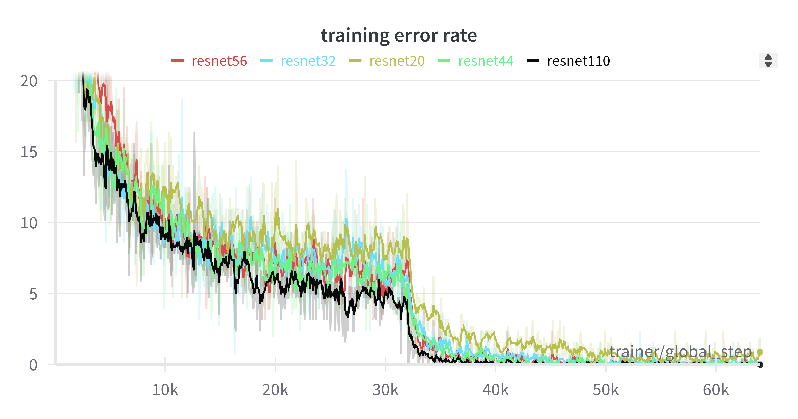
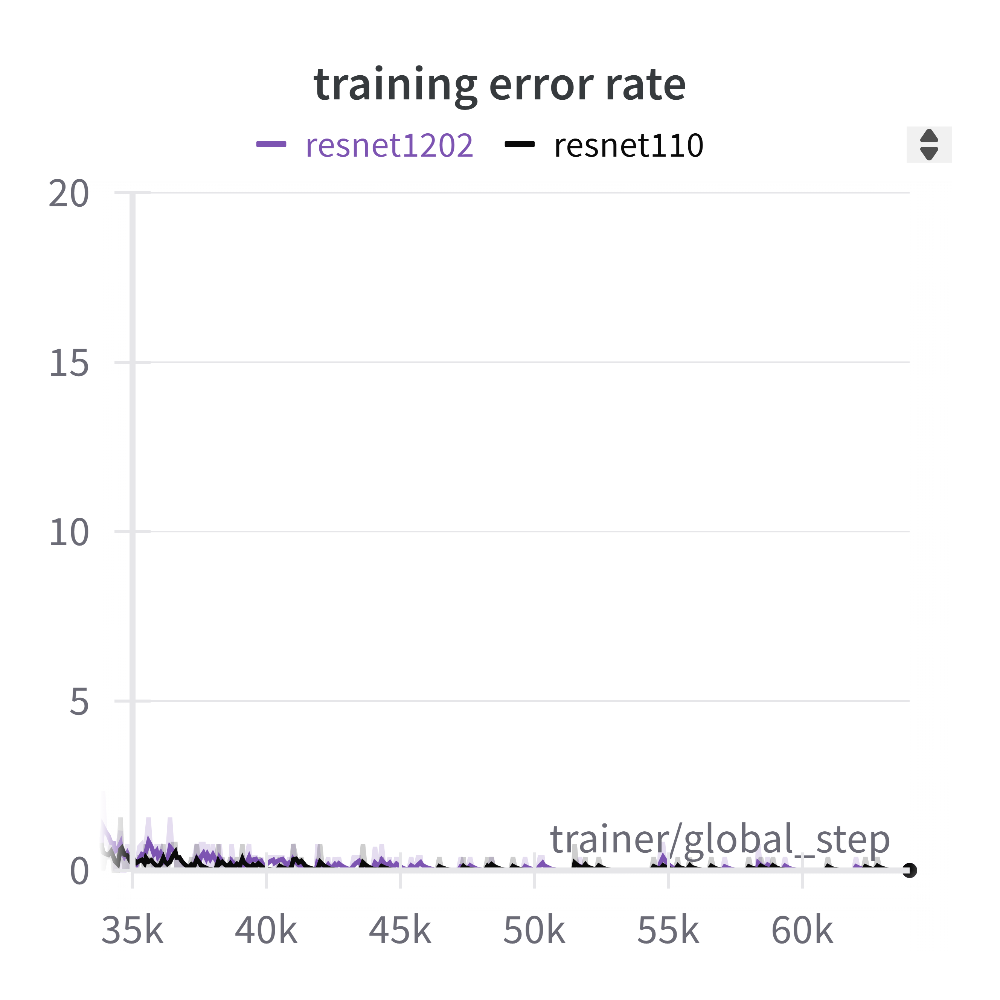
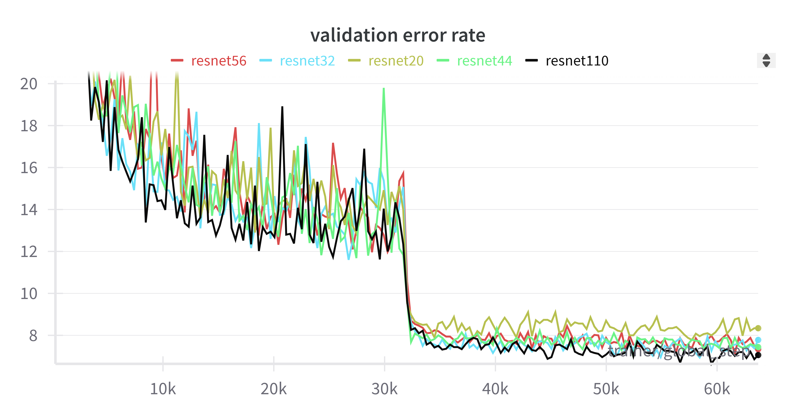
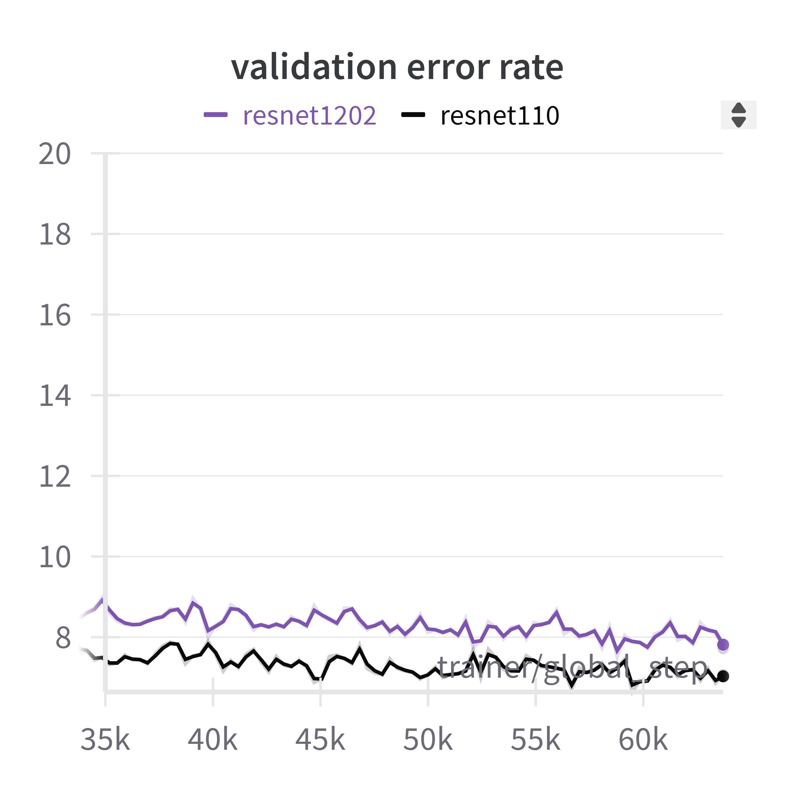
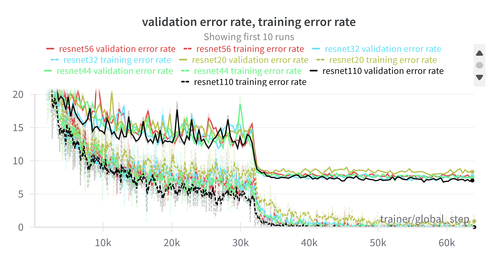
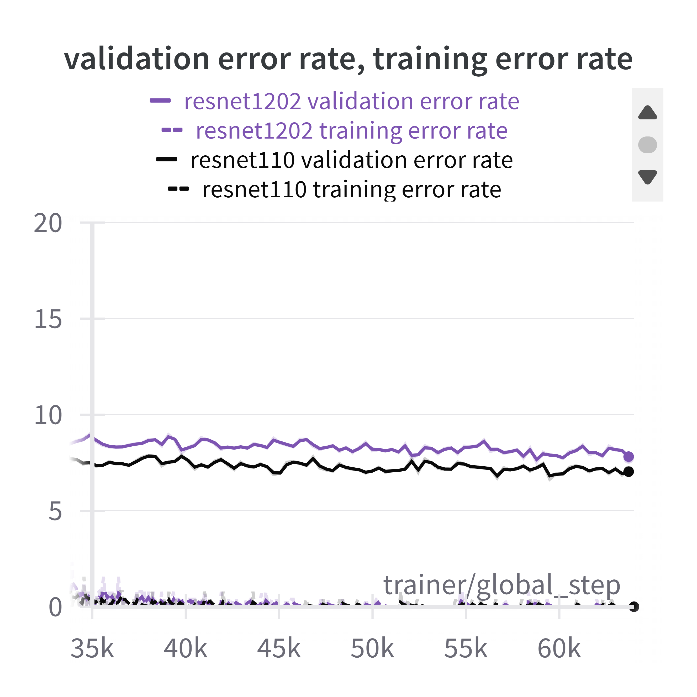
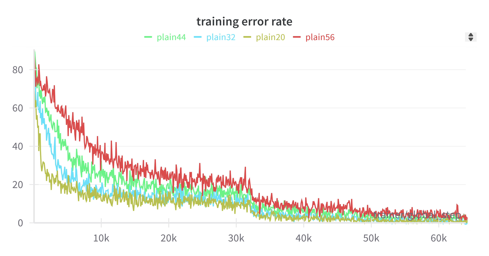
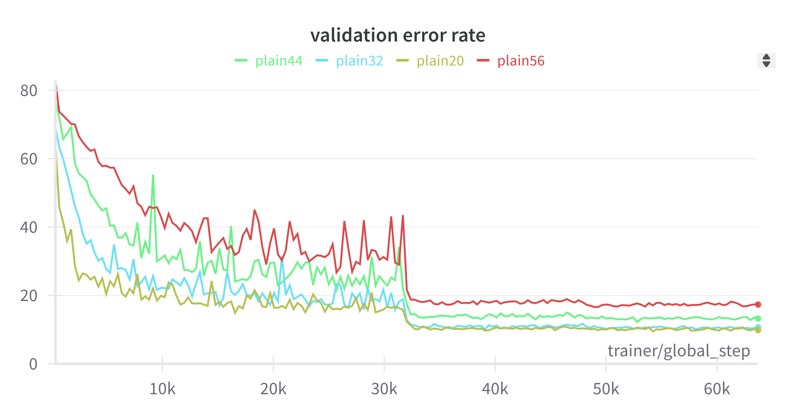

# cifar10_resnet
간단한 이미지 분류 모델입니다.

### Introduction

[Deep Residual Learning for Image Recognition](https://arxiv.org/pdf/1512.03385) 논문 속 section 4.2의 resnet model을 직접 구현해보았습니다.
학습 데이터셋은 cifar10을 사용했습니다.


### Requirements
After cloning the repo, run this line below:
```
pip install -r requirements.txt
```

### Usage

##### 1. train & test model
```
mkdir model
python -m cifar10_resnet.train -model {모델}
python -m cifar10_resnet.test -model {모델}
```

##### 2. statistics
| model  | # layers  | # params | error(%) |
|--------|:----------|----------|----------|
| resnet | 20        | 0.27M    | 9.15     |
| resnet | 32        | 0.46M    | 8.62     |
| resnet | 44        | 0.66M    | 7.82     |
| resnet | 56        | 0.85M    | tbd      |
| resnet | 110       | 1.7M     | 7.28     |
| resnet | 1202      | 19.4M    | 9.38     |


##### 3. plots
- training error(resnet)

, 

- testing error(resnet)

, 

- resnet

, 

- plain


